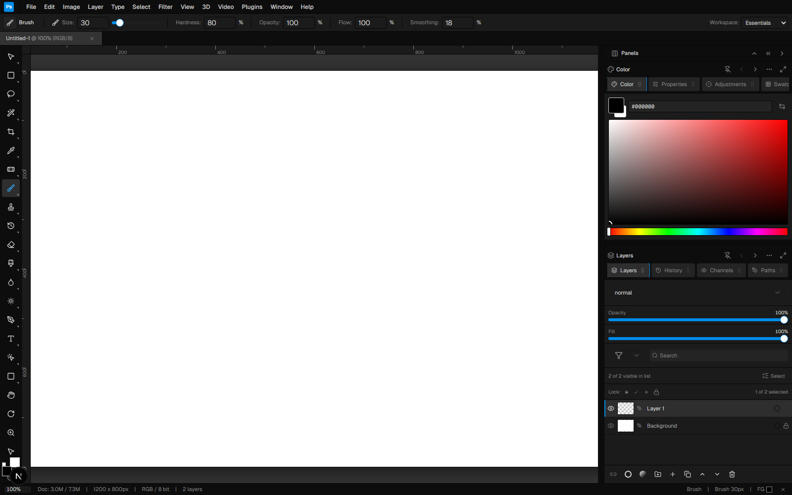
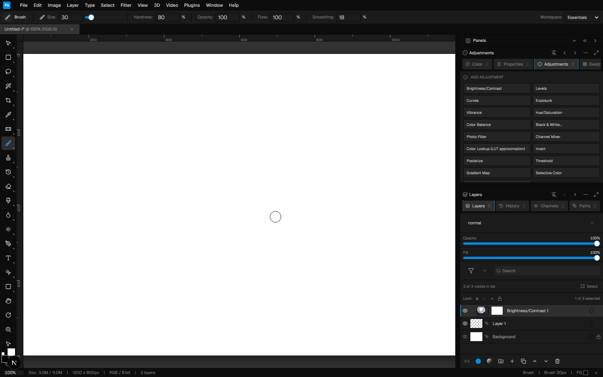
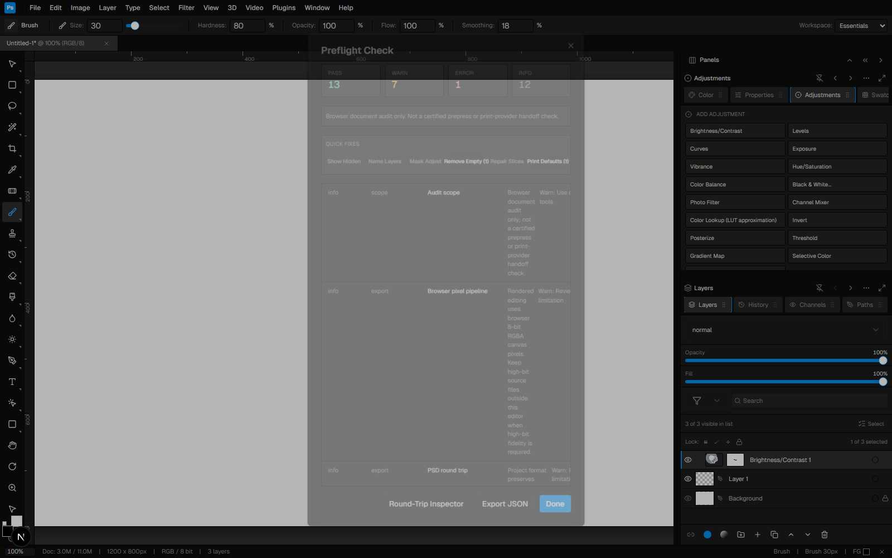
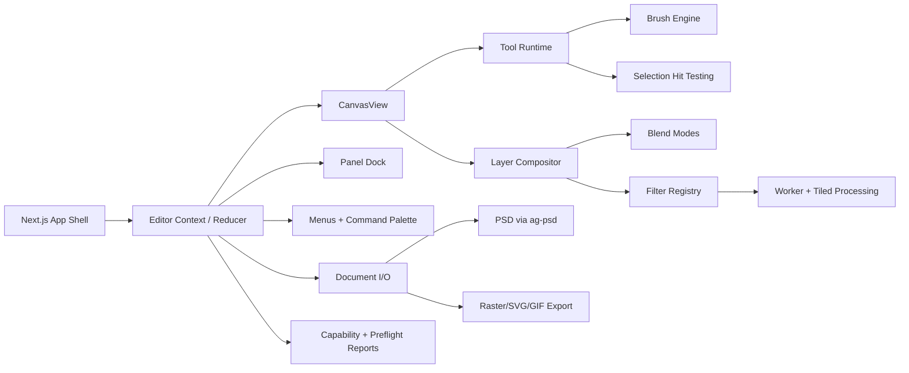

# Photoshop Web

<p align="center">
  
</p>

<p align="center">
  <strong>A browser-native Photoshop-style image editor built with Next.js, React, TypeScript, Canvas, workers, and a large Photoshop-inspired tool surface.</strong>
</p>

<p align="center">
  
  
  
  
</p>

> This project is an independent browser-based image editor. It is not affiliated with, endorsed by, or connected to Adobe or Adobe Photoshop.

## Table Of Contents

- [Overview](#overview)
- [Screenshots](#screenshots)
- [Highlights](#highlights)
- [Feature Map](#feature-map)
- [Architecture](#architecture)
- [Quick Start](#quick-start)
- [Scripts](#scripts)
- [Testing](#testing)
- [Project Structure](#project-structure)
- [Browser Reality And Limitations](#browser-reality-and-limitations)
- [Development Notes](#development-notes)

## Overview

Photoshop Web is a serious browser-based image editor with a Photoshop-inspired workspace: a central canvas, left tool palette, top menu bar, contextual options, dockable panels, document tabs, history, actions, layers, adjustments, masks, file/export workflows, and a broad filter library.

The app is designed around three goals:

1. **Photoshop-style workflows in the browser** - layers, masks, selections, tools, filters, panels, shortcuts, and document commands are exposed through a familiar editor shell.
2. **Honest browser limitations** - high bit depth, ICC profiles, CMYK/Lab/spot color, PSD round-trip behavior, and advanced format support are modeled and reported without pretending the browser can fully replace native Adobe engines.
3. **Regression-tested feature depth** - core editor behavior is covered by Playwright and focused unit/integration tests for tools, filters, PSD reporting, file format handling, performance paths, and workflow regressions.

## Screenshots

### Full Editor Workspace

The main workspace combines a Photoshop-like canvas, ruler area, vertical tool palette, contextual options bar, status bar, and a resizable panel dock.

<p align="center">
  
</p>

### Non-Destructive Adjustment Layers

Adjustment commands create real adjustment layers in the Layers panel. Masks are editable, can be inverted, and can be clipped to the layer below.

<p align="center">
  
</p>

### Preflight And Capability Reporting

The app includes preflight-style reporting for browser-native limits, layer state, export risks, color pipeline warnings, PSD compatibility, and quick fixes.

<p align="center">
  
</p>

## Highlights

| Area | What is implemented |
| --- | --- |
| Canvas editing | Brush, pencil, eraser, clone, healing, blur, sharpen, smudge, dodge, burn, sponge, gradients, paint bucket, transforms, zoom, pan, rulers, and custom context menu behavior. |
| Layers | Raster layers, groups, layer masks, vector masks, lock flags, blend modes, opacity/fill, clipping, layer filtering, color labels, layer comps, history snapshots, and selected-layer workflows. |
| Adjustment layers | Brightness/Contrast, Levels, Curves, Exposure, Vibrance, Hue/Saturation, Color Balance, Black & White, Photo Filter, Channel Mixer, Color Lookup, Invert, Posterize, Threshold, Gradient Map, Selective Color, Shadows/Highlights, and more. |
| Selections and masks | Marquee, lasso, magnetic lasso, magic wand, quick selection, object selection, select subject, select sky, select background, expand/contract/smooth/feather/border, save/load selection, quick mask, and select-and-mask style workflows. |
| Filters | Blur, sharpen, distort, render, noise, stylize, gallery-style filters, smart-filter metadata, golden-image tests, worker-backed filters, and tiled processing plans for expensive operations. |
| File I/O | Project persistence, PSD import/export through `ag-psd`, raster export, SVG export, GIF data URL export, recent documents, export presets, round-trip reports, and explicit limitation reporting. |
| Typography | Text layers, character/paragraph panels, font diagnostics, match-font style flows, find/replace text, text inside shape, text-to-path/shape conversion, OpenType-style controls, anti-alias mode modeling, and 3D text metadata/workflows. |
| 3D and video | 3D workspace hooks, material workflows, OBJ/DAE-style local support, 3D print/preflight checks, video timeline, frame animation, trimming/splitting-style controls, audio metadata, and export preset modeling. |
| Automation | Actions panel, command palette, scripting console with restricted API commands, batch-oriented dialogs, droplets-style local automation modeling, history log, and keyboard shortcut import/export. |
| Preferences and performance | RAM/cache/scratch/GPU preference modeling, tool behavior preferences, rulers/units/grid settings, preference import/export/reset, zoom coalescing, history scheduling, render caching, worker fallback tests, and tiled filter paths. |

## Feature Map

### Workspace

- Photoshop-inspired top menus: File, Edit, Image, Layer, Type, Select, Filter, View, 3D, Video, Plugins, Window, and Help.
- Command palette for fast access to tools, panels, filters, document commands, and advanced workflows.
- Workspace presets for Essentials, Photography, Painting, and Web.
- Right dock with pinned panels, panel browser, compact/hidden modes, resize controls, and upper/lower panel stacks.
- Status bar with document size, color mode, bit depth, zoom, layer count, and tool state.

### Tools

The editor exposes a wide tool surface, including:

- Move, artboard, transform, hand, rotate view, and zoom.
- Marquee, lasso, polygonal lasso, magnetic lasso, magic wand, quick selection, object selection, refine edge brush, select subject, select sky, and select background.
- Crop, perspective crop, slice, slice select, and frame.
- Eyedropper, color sampler, ruler, note, count, material eyedropper, and material drop.
- Brush, pencil, mixer brush, color replace, clone stamp, pattern stamp, history brush, and art history brush.
- Spot healing, healing brush, red eye, patch tool, content-aware move, and remove tool.
- Eraser, background eraser, magic eraser, gradient, paint bucket, blur, sharpen, smudge, dodge, burn, and sponge.
- Pen, freeform pen, curvature pen, add/delete anchor point, convert point, path selection, and direct selection.
- Horizontal/vertical type, type masks, rectangle/ellipse/polygon/triangle/line/custom shapes.

### Panels

Panels are grouped by purpose and can be searched, pinned, unpinned, resized, or opened from the command palette.

| Category | Panels |
| --- | --- |
| Core | Color, Brush, Properties, Adjustments, Layers, Channels, History |
| Color and assets | Swatches, Gradients, Patterns, Assets, Libraries |
| Type and vector | Glyphs, Styles, Shapes, Character, Paragraph, Paths |
| Inspection and guides | Navigator, Histogram, Info, Guides, Measurement Log |
| Selection | Selection Studio |
| Motion and automation | Actions, Layer Comps, Clone Source, Timeline, Animation, Slices, Scripting |
| Collaboration and learning | Comments, Annotations, Notes, Learn, Discover |

### Filters And Image Operations

- Filter registry with adjustment, blur, sharpen, distort, render, noise, stylize, and gallery-style definitions.
- Worker-supported filters for common pixel operations such as invert, grayscale, desaturate, sepia, threshold, posterize, exposure, brightness/contrast, Gaussian blur, box blur, motion blur, sharpen, unsharp mask, noise, ripple, clouds, difference clouds, and fibers.
- Tiled execution planning for large or expensive filters.
- Golden-image tests for deterministic filter behavior.
- Smart-filter metadata and non-destructive approximation reports.

### File Formats And Export

- Project-native persistence for editor-only metadata.
- PSD import/export via `ag-psd`.
- Rich PSD compatibility reports for blend modes, groups, masks, text, styles, adjustments, and app-only metadata.
- Raster export paths for PNG, JPEG, WebP, AVIF, GIF, and SVG.
- Export presets and explicit browser limitation reports.
- Modeled support and honest reporting for advanced formats and workflows where the browser cannot fully preserve native semantics.

## Architecture



The core state lives in the editor context and is mutated through typed actions. The canvas reads the active document, composites the layer stack, and routes pointer input to tool-specific behavior. Panels and menus dispatch the same editor actions, which keeps UI commands, keyboard shortcuts, and command-palette operations aligned.

## Quick Start

### Requirements

- Node.js 20+ recommended.
- npm.
- A modern Chromium-based browser for the best Canvas and Playwright behavior.

### Install

```bash
npm ci
```

### Run The Development Server

```bash
npm run dev
```

Then open:

```text
http://localhost:3000
```

### Production Build

```bash
npm run build
npm run start
```

## Scripts

| Command | Purpose |
| --- | --- |
| `npm run dev` | Start the Next.js development server. |
| `npm run build` | Build the production app. |
| `npm run start` | Serve the production build. |
| `npm run lint` | Run ESLint across the repository. |
| `npm run typecheck` | Run TypeScript without emitting output. |
| `npm run test:smoke` | Run the Playwright test suite. |
| `npm run verify` | Run typecheck, production build, and Playwright smoke tests. |

## Testing

The repository has broad test coverage across UI workflows, pixel behavior, filters, file reports, performance scheduling, and browser limitations.

Useful test groups:

```bash
# TypeScript only
npm run typecheck

# Lint only
npm run lint

# Production build
npm run build

# Full Playwright suite
npx playwright test

# Focused examples
npx playwright test tests/adjustment-layer-workflow.spec.ts
npx playwright test tests/canvas-interaction-performance.spec.ts
npx playwright test tests/filter-fidelity-golden.spec.ts
npx playwright test tests/psd-roundtrip-fixtures.spec.ts
```

Representative test coverage includes:

- Adjustment-layer creation, mask painting, clipping, inversion, and settings panel behavior.
- Rapid zoom, undo/redo, right-click canvas behavior, and brush performance.
- Menu and command access for nested features.
- File I/O hardening, PSD fixture coverage, export limitations, and compatibility reports.
- Color and bit-depth honesty warnings.
- Worker/tiled filter paths and golden-image filter fidelity.
- Preflight, print, and advanced format reporting.

## Project Structure

```text
app/
  page.tsx                    Main editor shell
  layout.tsx                  App metadata and root layout

components/photoshop/
  canvas-view.tsx             Canvas rendering, input routing, compositing hooks
  editor-context.tsx          Document state, actions, history, persistence
  menu-bar.tsx                Photoshop-style menus and command routing
  command-palette.tsx         Searchable commands, tools, panels, filters
  filters.ts                  Filter registry and pixel algorithms
  filter-worker.ts            Worker/tiled filter execution helpers
  document-io.ts              Project, PSD, raster, SVG, GIF, and report helpers
  panel-dock.tsx              Resizable panel dock and workspace behavior
  panel-registry.tsx          Panel definitions and workspace presets
  panels/                     Layers, Adjustments, Timeline, Actions, etc.

tests/
  *.spec.ts                   Playwright and unit/integration regression tests

docs/images/
  editor-overview.png
  adjustment-layer-mask.png
  preflight-report.png
```

## Browser Reality And Limitations

This project intentionally models and reports limits that cannot be fully solved inside the browser:

- **Color management**: browser canvas editing resolves through 8-bit RGBA surfaces. CMYK, Lab, spot, multichannel, ICC, 16-bit, and 32-bit intent can be modeled and warned about, but not fully preserved through every destructive browser edit.
- **PSD round trip**: supported PSD data is imported/exported through `ag-psd`; app-only constructs are preserved best in the project format and reported as approximations for PSD/raster export.
- **Advanced formats**: TIFF, PDF, EPS, HEIF, JPEG 2000, PSB, 3D, and video workflows are modeled where practical, but native parity depends on browser APIs and available JavaScript libraries.
- **Performance**: workers, tiling, render caching, zoom coalescing, and history scheduling reduce main-thread pressure, but very large documents can still exceed practical browser memory limits.

These limitations are surfaced through status warnings, preflight reports, export limitation reports, and compatibility manifests rather than hidden behind silent lossy conversions.

## Development Notes

- Keep editor behavior centralized through typed editor actions when possible.
- Prefer adding workflow coverage in `tests/` for every feature that changes the canvas, document model, layer stack, or export behavior.
- Use project-native metadata for app-only behavior, and make PSD/raster export limitations explicit.
- When adding filters, decide whether they belong in the worker-supported path, tiled path, or synchronous fallback path, then add fidelity tests.
- When adding panels, register them in `panel-registry.tsx` so they are discoverable through the dock, command palette, and workspace presets.

## License

No license file is currently included in this repository. Treat the code as private/proprietary unless a license is added.
